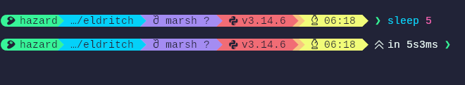
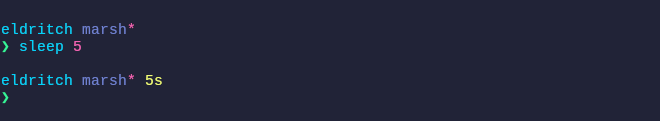
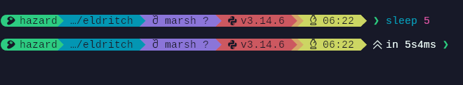
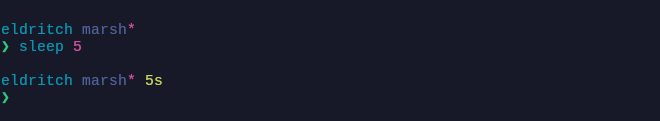
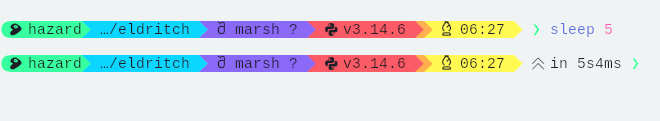
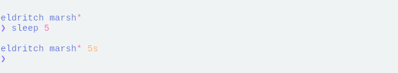

<!-- DO NOT CHANGE THIS -->
<p align="center">
  
</p>
<p>
  Eldritch is a community-driven dark theme inspired by Lovecraftian horror. With tones from the dark abyss and an emphasis on green and blue, it caters to those who appreciate the darker side of life.
</p>

Main Theme repo can be found [here](https://github.com/eldritch-theme/eldritch)

### Showcase

<!-- Your screenshots should go here -->

<details>
    <summary>🦑 Cthulhu (Default)</summary>
    
    
</details>
<details>
    <summary>🌀 Abyss (Darker)</summary>
    
    
</details>
<details>
    <summary>🌅 Dusk (Light)</summary>
    
    
</details>

### Installation

<!--
Avoid instructing users to execute shell commands. Prefer plain text instructions unless commands are strictly necessary (for example, when using a dedicated installation script).

Prefer release downloads or links to files/directories within the repository over Git commands, curl, wget, or similar download methods.

Build instructions should be documented separately (for example, in BUILD.md).
-->

1. Download your preferred variant from [themes](themes/) into `~/.config/starship.toml`
2. Set the definition for your preferred palette:
   ```toml
   palette = "eldritch_cthulhu"
   palette = "eldritch_abyss"
   palette = "eldritch_dusk"
   ```
